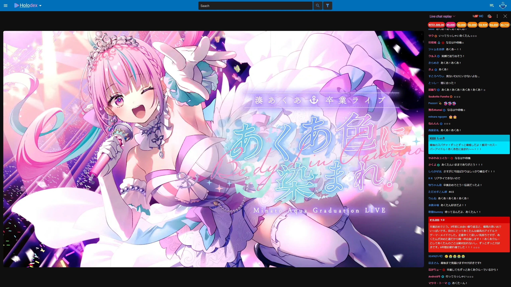
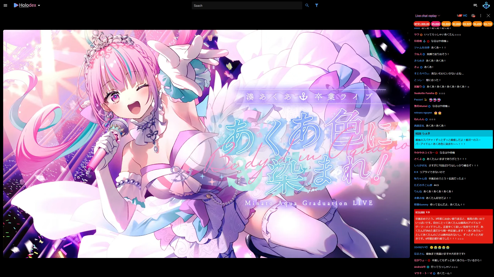
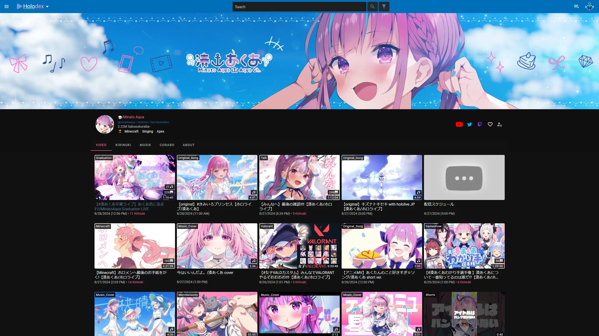
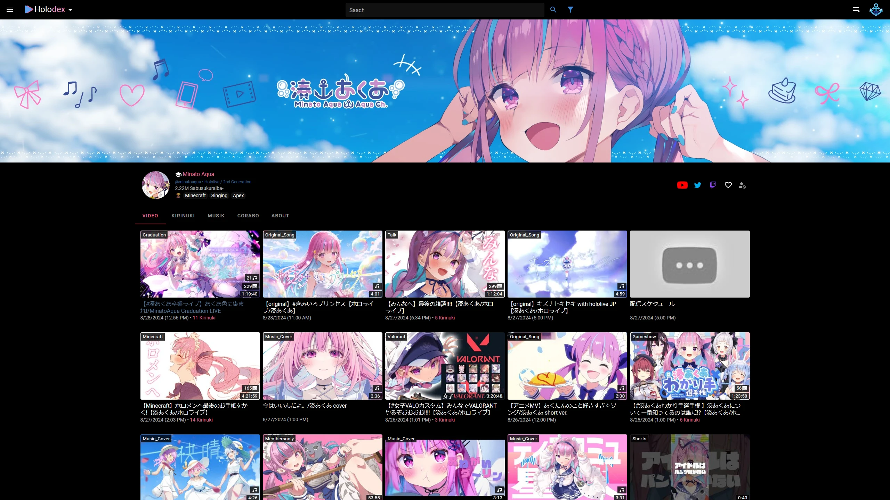
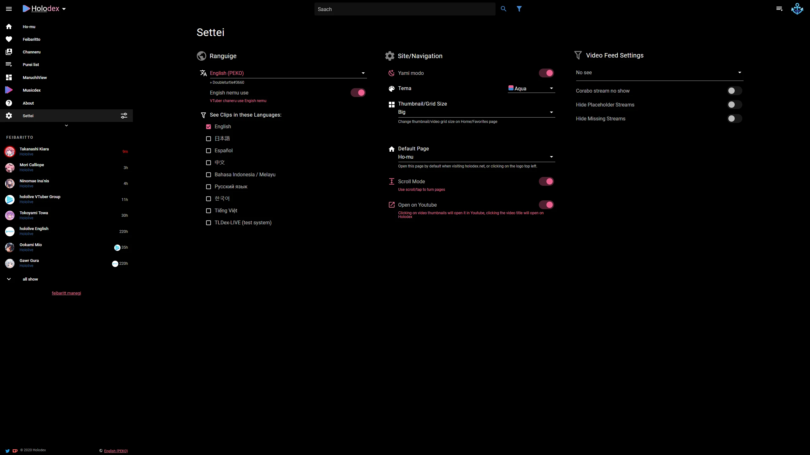

<h1 align="center">  Holodex & YouTube Tweaks  </h1>

> [!IMPORTANT]
> **For this installation link to work the stylus browser extension is necessary**
> 
> * **Chrome**: https://chromewebstore.google.com/detail/stylus/clngdbkpkpeebahjckkjfobafhncgmne
> * **Firefox**: https://addons.mozilla.org/en-US/firefox/addon/styl-us/

[](https://raw.githubusercontent.com/Himither/Holodex-Youtube-Tweaks/master/holodex.user.css)

## Table of Contents
 1. [Features](#features)
	* [Holodex](#holodex-features)
 	* [YouTube](#youtube-features)
 3. [Preview](#preview)
	* [Holodex](#holodex-preview)
 	* [YouTube](#youtube-preview)
 4. [Details](#details)
	* [Holodex](#holodex)
	* [Hyperchat](#hyperchat)
	* [Custom Avatar](#custom-avatar)

## Features

### Holodex Features

* Better dark mode and true black mode (+ option to hide borders)
* Improved Singleview & Multiview viewing experience
* Adjustable chat and menu width
* Extended color theme (currently only Aqua)
* Custom Avatar
* Hide Scrollbars

### YouTube Features

* Better dark mode (+ option to hide chat/playlist borders)
* Adjustable menu width
* Full height playlist & livechat
* Show header only on hover
* Full width mode
* Textless buttons (below video: Save, Like, etc...)
* Hide Scrollbars

## Preview

### Holodex Preview

#### Singleview

<p align="center">
  
&nbsp; &nbsp; &nbsp; &nbsp;
  
</p>

#### Channeru

<p align="center">
  
&nbsp; &nbsp; &nbsp; &nbsp;
  
</p>

#### Settai

<p align="center">
  
&nbsp; &nbsp; &nbsp; &nbsp;
  
</p>

### YouTube Preview

## Details

### [Holodex](https://holodex.net/)

**Turn on Holodex own dark mode** for the the two extended dark modes to display properly.

You can either use the browser fullscreen mode or use a **GOOD** black theme, without any borders, to get the ultimate dark mode experience.

### [Hyperchat](https://livetl.app/hyperchat)

> [!WARNING]
> Rarely, **when Hyperchat has an update waiting for you to accept**, the styling will temporarily not affect it until you **confirm the update**.

> [!TIP]
> If you want to **always see Live Chat** activate the hyperchat setting:
> *HyperChat Settings -> Additional Options -> "Automatically switch to Live Chat"*

Alternatively you could set the dropdown menu to show again and **increase the chat width** enough for it to display properly

### Custom Avatar

You can simply insert a link or [convert a Image to Base64](https://codebeautify.org/image-to-base64-converter) and use it in a [Data URL](https://developer.mozilla.org/en-US/docs/Web/URI/Schemes/data). 

> [!IMPORTANT]
> **In both cases you must _wrap your input in single quotes_.** 

Link: ```'https://example.link'```

Data URL : ```'data:image/webp;base64,<Base64 String>'``` (for a converted .webp, **without** the <> surrounding it)

> [!TIP]
> In my experience it seems to be fine to omit the MIME type (e.g. **image/webp**) in this particular use-case.
> 
> So ```'data:;base64,<Base64 String>'``` does also suffice.

**Full example**:

```'data:image/webp;base64,UklGRlQEAABXRUJQVlA4WAoAAAAQAAAAHwAAHwAAQUxQSBICAAABkCzJtmlb8+LZtm3btm3bttG0bdu2bfsd7mNjazS21vuDiJgA0p+iWIMGRZKJfaGVb2y2V0vyMyt4RgYA6Vg+RsnLJIj/TCLEBYlsCr6BuLtylQMSnuVlU4uDqQpRLRusVZlZahDV42Cpwib/S0hH6tY/KeNxbjYJC0RInEMGP4NYpmpSJPdBHgD4PdmLNU5pKMVY2+WyRZZzgHVxofLXLSOStZKSiSjlGCfkV8fPcoDlzIk3ADciBRElJxK1XVU9kXq4YJjrREm1VzWnFJvxfUaONv+M/WqWc84vrEnKfguIn63X5y+EO3sPmYDfB/c+kPCza8OLPHAlS7lvAPBl0KBvBwulyHoROJYpRbHjn3oP+wEAH0u2dCrgWtAwJ1G688CR1ES5GyzxQGlv1D+ogujcIpkpjSIlZSq6KA5Vf89JMUX08foJ96/ObXEdONN4zuWH0zY8jSnCI+byClcHqumExPkBl02CqzZ18ypiU+eJfhOAAxlqO6HTWSfzcUA2BcTZk18N6eMCInMa2PRwTRbFAK77iFej85agNFsAeHf8iXp5Be+Nmg74AHldqoSSuYmISj0EIHi2rw8qQpt2eUUAd4qRdr3XAGSzBapWqwzgRS3SW+8BjMp3apH+Ehtd+hxri5LRNO0uRLQi51qnJobZR79Tkd+MzEaMy210A851ZYh9ms63b3ZMTf+1QH4yClZQOCAcAgAAcAsAnQEqIAAgAD6ROplIpaMiITAYCACwEglsALElQX4BoAOKpcDgAbZO7Rt5drj75X0BCK6wFeLZAhhPj9+oPYJ/VXq6eRmtrnQSuH3ChFE4opckVa3JtNmgrMpnoyY2Qqa/AAD+/1bByQ5X7f0FTbi9///oM9b4f0UKG5y0ZhjoB/F7d+1RfznoN9iPabRgW1getuHgD2DWz6uPj/qi5/3xYQGFe5tvdt1DnN/n+f87rh3rajElPRgjpj/UNhp5SXw+fXe/kVgQTCs6yRzefU0NTyPZdFkfqZQQ3FzLCM+efETin6icjy1f29m33qq7ettIJTOaeddxZAvVkj3Aga8u/7YiHGmiX/HQKN9ZHVgMHzbUD4lyP6we+QPSqOOUyLexvYaByClWPrTsmSdquMyf6dxsv7UQteanXgr6VDL6d/6+7bwWR41XQ8TT/pYs9Oz/5Wkw1dufjWKEK1daMzPiZ8D8GZvSc+OzSKD520BH+WZdbVjqzUxplzwOtDApjr06+La0Fb4XdP8OhH1PvPnwM3cSjWojaZbWuyx5/n54WqjevlxBh38so/VYGAYUHaGHcvmX58rdxbTbwTYaCD791QbZ++nS00qtH7iffOGjtAT+v0rzWF4/L1llWUuQ55bKYt7/rEf3cwfTBVAb/dTFRYmD6tH5JjFEgkGINv2LXVUCeBLlyxnDmrNrbaex7GrVSmaxwF3HB+AA'```
